# example-microchip-sama7g54-yocto
# Introduction

This repository contains:

- A Dockerfile to build an image which can be used as a container for running the Yocto steps

# Prerequisites

- An Edge Impulse account
- The Microchip [SAMA7G54-EK Evaluation Kit](https://www.microchip.com/en-us/development-tool/EV40E67A)

# Hardware Setup

Set [these jumpers](https://developerhelp.microchip.com/xwiki/bin/view/software-tools/32-bit-kits/sama7g54-ek/features/#jumpers) to the default settings:


Provide power to the board [as described in the Microchip documentation](https://developerhelp.microchip.com/xwiki/bin/view/software-tools/32-bit-kits/sama7g54-ek/features/#power).

# Yocto

Build with:
`docker build --no-cache -t microchip-yocto .`

Run with:
`docker run -it microchip-yocto`

Inside the container, source environment:
`source oe-init-build-env build-microchip`

Display for menuconfig:
`echo $DISPLAY`

Enter menuconfig for the kernel:
`bitbake -c menuconfig virtual/kernel`

## Kernel menuconfig

Main screen:
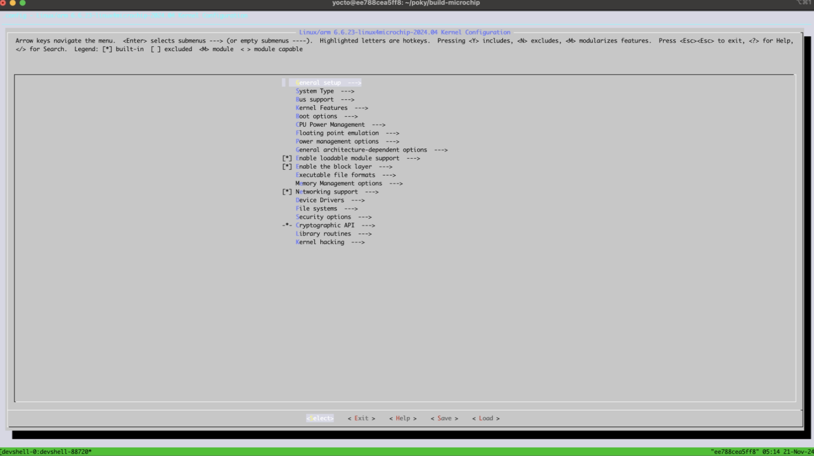

Device Drivers:
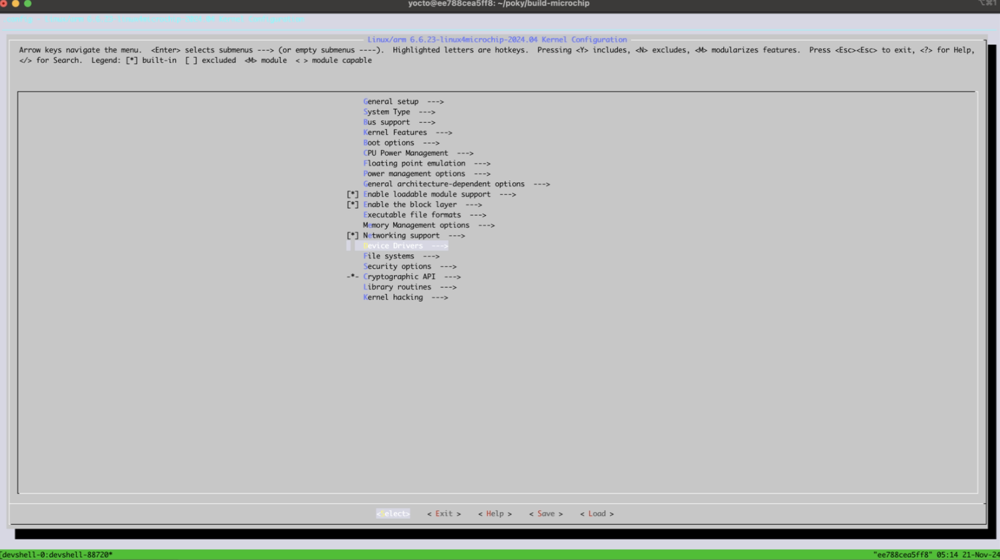

Multimedia Support:
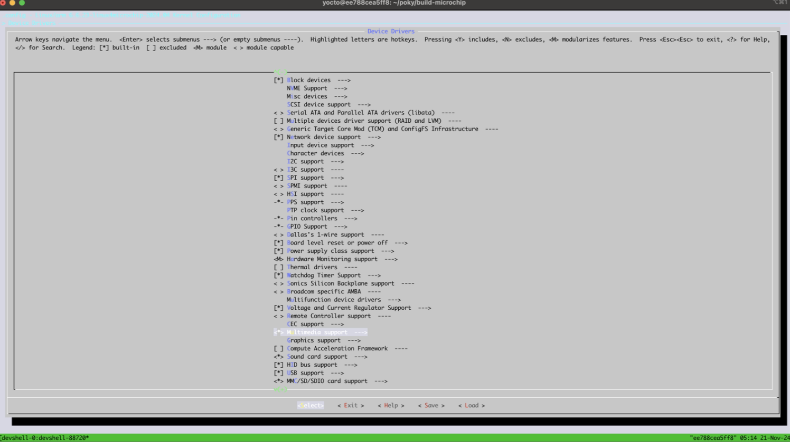

Media Drivers:
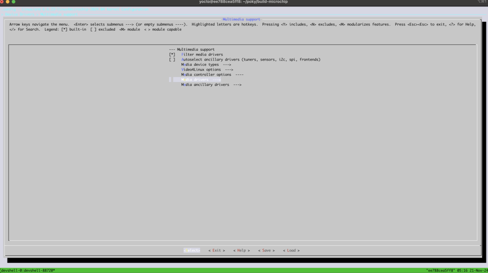

Media USB Adapters:
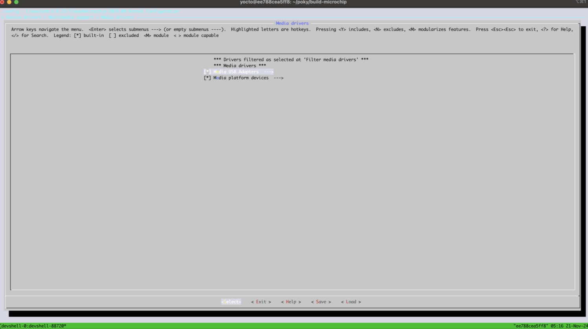

USB Video Class defaults to Module:
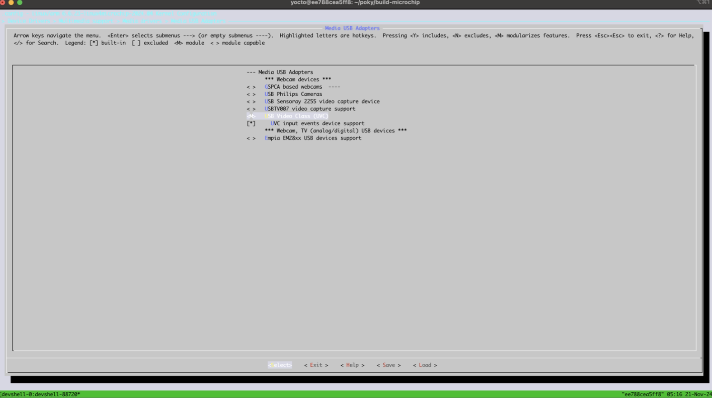

Change it to fully included [*]


When saving you must enter a filename:


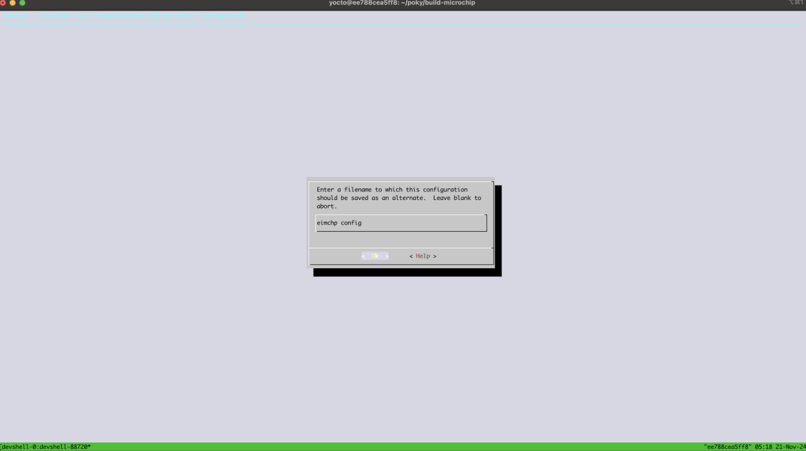

Ensure the config saved:
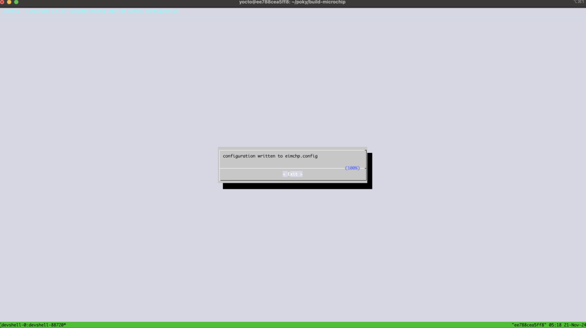

Exit the menuconfig and save it with this command:

`bitbake -c savedefconfig virtual/kernel`

## Custom layer

Now make a custom layer:
```
cd /home/yocto/poky/build-microchip
bitbake-layers create-layer ../meta-my-layer
bitbake-layers add-layer ../meta-my-layer
```

Add the saved config to the new layer:
```
mkdir -p ../meta-my-layer/recipes-kernel/linux
nano ../meta-my-layer/recipes-kernel/linux/linux-mchp_%.bbappend
```

Paste this and save with `Ctrl+X` then `Y` and `Enter`:
```
FILESEXTRAPATHS:prepend := "${THISDIR}/files:"

SRC_URI += "file://defconfig"

KBUILD_DEFCONFIG = "defconfig"

do_configure:prepend() {
    cp ${WORKDIR}/defconfig ${B}/.config
}
```

Finally copy the defconfig:
```
mkdir -p ../meta-my-layer/recipes-kernel/linux/files
cp /home/yocto/poky/build-microchip/tmp/work/sama5d2_xplained-poky-linux-gnueabi/linux-mchp/6.6+gitAUTOINC+bf96df8309-r0/build/defconfig ../meta-my-layer/recipes-kernel/linux/files/defconfig
```

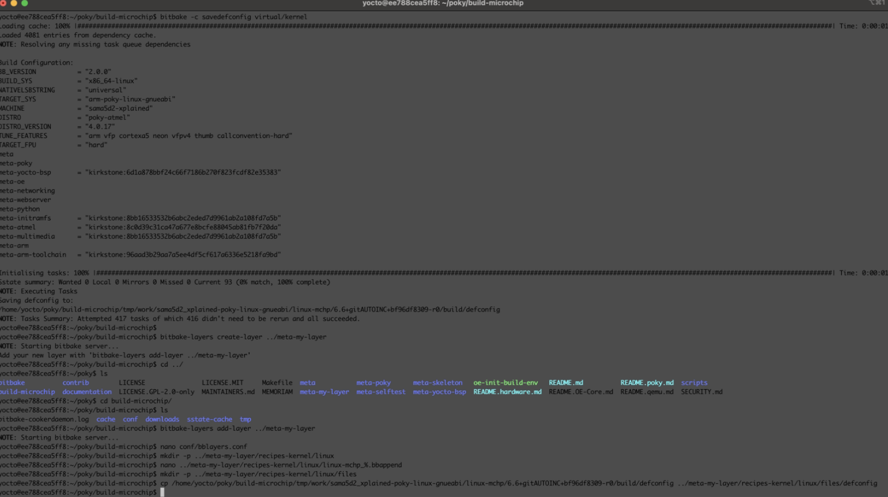

Clean and build the kernel:
```
bitbake -c clean virtual/kernel
bitbake virtual/kernel
```

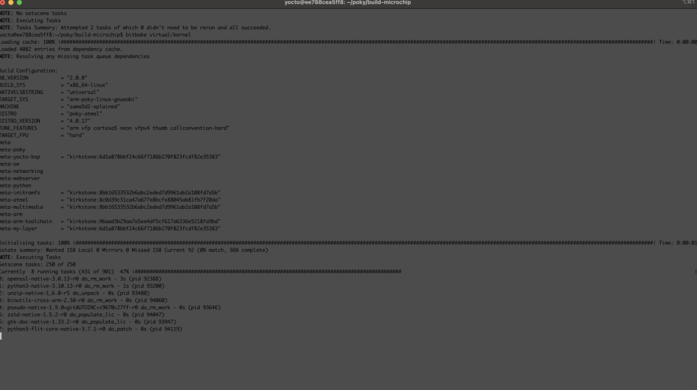

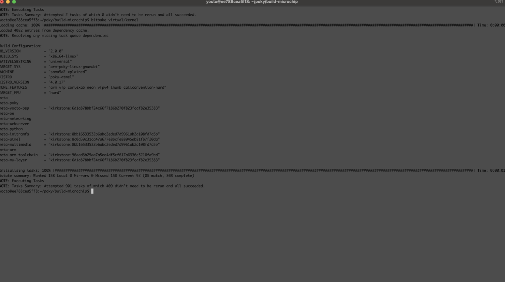

Now update the **local.conf** file by opening it `nano conf/local.conf` and navigating to the end then paste this:
```
IMAGE_ROOTFS_EXTRA_SPACE = "1048576"
IMAGE_INSTALL:append = " make gcc gcc-symlinks g++ g++-symlinks python3 python3-core python3-modules nodejs nodejs-npm binutils"
IMAGE_INSTALL:append = " gstreamer1.0 gstreamer1.0-plugins-base gstreamer1.0-plugins-good gstreamer1.0-plugins-bad gstreamer1.0-plugins-ugly gst-devtools"
IMAGE_INSTALL:append = " v4l-utils usbutils kernel-modules"
IMAGE_FEATURES += " ssh-server-openssh"
DISTRO_FEATURES ?= " usbgadget usbhost wifi opengl"
```

These added lines give the image 1 GB free space, basic build tools & kernel modules, USB host controller, SSH, python, nodejs/npm, and gstreamer which are required to install and use **edge-impulse-linux**

Save with `Ctrl+X` then `Y` and `Enter`:

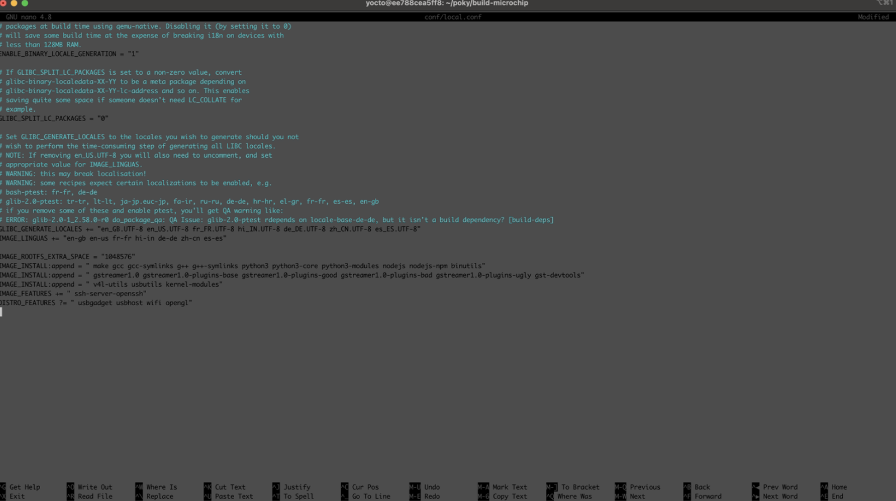

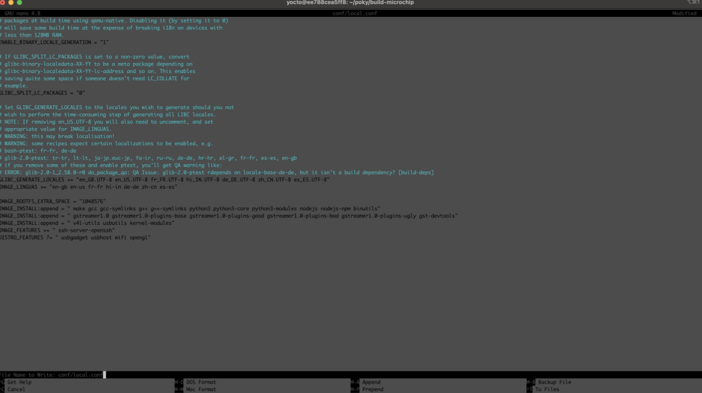

You can now bake the image with the following command (on a 16 core Mac this took approximately 4 hours):

`MACHINE=sama7g5ek-sd bitbake core-image-minimal`

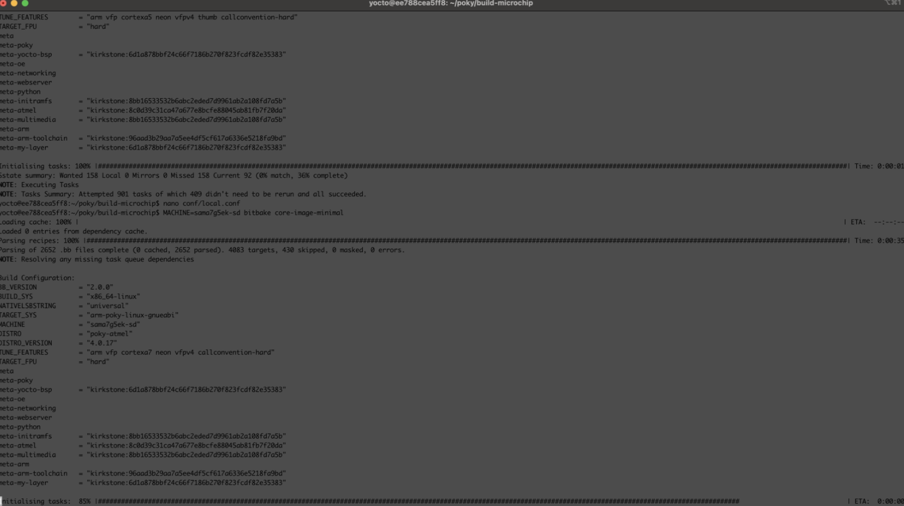

After the image builds open a separate terminal and copy the files out of the container with the following command, replacing the ID with your Docker container ID:

`docker cp ba0124894119:/home/yocto/poky/build-microchip/tmp/deploy/images/sama7g5ek-sd .`

Find the large **.wic** file, with a name like **core-image-minimal-sama7g5ek-sd-20241121054315.rootfs.wic** and use [BalenaEtcher](https://etcher.balena.io/) to flash it onto an SD card.

Further documentation on building Linux images for these devices is [available at Microchip](https://developerhelp.microchip.com/xwiki/bin/view/software-tools/32-bit-kits/sama7g54-ek/booting-linux-image/).

# Connecting the EVK

The Microchip Developer Help portal has documentation for [serial communications to the SAMA7G54-EK](https://developerhelp.microchip.com/xwiki/bin/view/software-tools/32-bit-kits/sama7g54-ek/console_serial_communications/). Once your serial terminal is connected make sure the device has power and press the `nStart` button, you should see messages appearing over the serial console.

Login with `root` user

## Install Edge Impulse

When logged into the SAMA7 as root via the serial terminal or SSH, run the following command to install edge-impulse-linux:

`npm install -g edge-impulse-linux`

Connect a webcam to the board and run `edge-impulse-linux`, and proceed to login and choose a project to connect the device.

Go to your studio project and start collecting data!

# Next Steps

See our [documentation for the Microchip SAMA7](https://docs.edgeimpulse.com/docs/edge-ai-hardware/cpu/microchip-sama7) for more details on using the SAMA7 with Edge Impulse and links to public projects supporting the hardware.